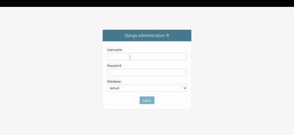

# multidb-admin

`multidb-admin` is a Django package that allows users to select a database with credentials in the Django admin interface. This package enables users to access data from the selected database while restricting access to the `User` model.

## Demo



## Installation

1. Install the package using pip:

   ```
   pip install multidb-admin
   ```

2. Add `'multidb_admin'` to the `INSTALLED_APPS` list in your Django project's `settings.py`. Make sure it should be placed before `django.contrib.admin`:

   ```python
   INSTALLED_APPS = [
       # ...
       'multidb_admin',
       # ...
       'django.contrib.admin'
   ]
   ```
3. Add middleware in `settings.py`

   ```python
   MIDDLEWARE = [
   # ...
    'multidb_admin.middleware.MultiDBAdminMiddleware',
   ]
   ```

4. Configure your database settings in `settings.py`:

   ```python
   DATABASES = {
       'default': {
           'ENGINE': 'django.db.backends.sqlite3',
           'NAME': BASE_DIR / 'db.sqlite3',
       },
       'db1': {
           'ENGINE': 'django.db.backends.sqlite3',
           'NAME': BASE_DIR / 'db.sqlite3_1',
       },
       'db2': {
           'ENGINE': 'django.db.backends.sqlite3',
           'NAME': BASE_DIR / 'db.sqlite3_2',
       },
       'db3': {
           'ENGINE': 'django.db.backends.sqlite3',
           'NAME': BASE_DIR / 'db.sqlite3_3',
       },
   }
   ```
   - Here, `default` database will act as a master db where master user data will store in User table.
   - Make sure every db is migrated with `./manage.py migrate --database=db_name` command

## Usage

1. Log in to the Django admin interface.

2. Navigate to the `multidb-admin` section.

3. In the `multidb-admin` section, you can perform the following actions:

   - Select a database by providing the username, password, and selecting a database from the available options.
   - After selecting a database, your session will be activated for that database.
   - You can access all the data of the selected database except for the `User` model, which is restricted.

4. Enjoy the benefits of working with multiple databases in the Django admin interface!

## Contributing

We welcome contributions to improve `multidb-admin`. If you find any issues or have suggestions for enhancements, please open a GitHub issue or submit a pull request.

## License

`multidb-admin` is released under the MIT License.
